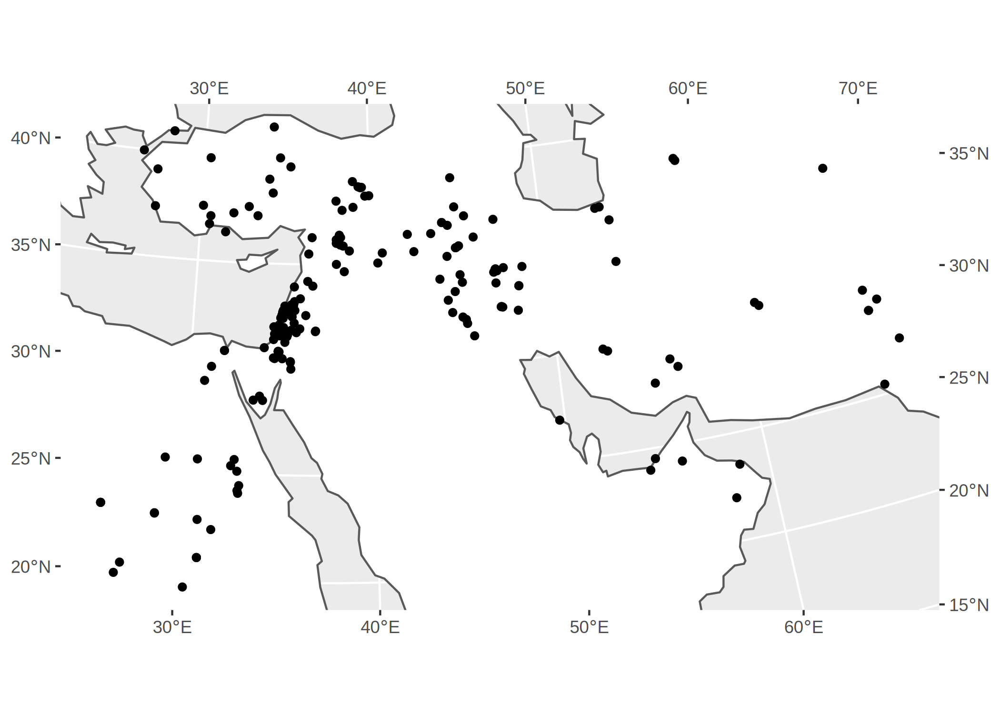

Data from Uerpmann’s (1987), *[The Ancient Distribution of Ungulate Mammals in the Middle East](https://reichert-verlag.de/en/author/u/uerpmann_hans_peter/9783882263954_the_ancient_distribution_of_ungulate_mammals_in_the_middle_east-detail)*, volume 27 of the Tübinger Atlas des Vorderen Orients (TAVO), Series A.

Uerpmann catalogued the occurrence of ungulate taxa in animal bone assemblages from 196 sites across the Middle East, from the Lower Palaeolithic to the historic period. Though no longer up-to-date, it remains one of the most comprehensive resources on quaternary biogeography in Southwest Asia. Here, the catalogue included in the volume has been transcribed into a structured format suitable for modern computerised data analysis.

## Data

* [Source repository](https://github.com/joeroe/tavo-a27) (GitHub)
* [Archive](https://zenodo.org/record/3362929) (Zenodo)
